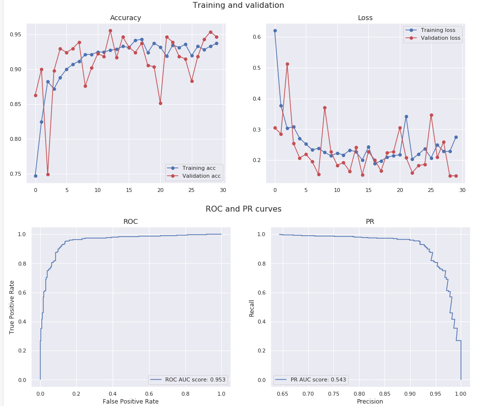

# Identifying pneumonia disease on chest X-rays by image-based deep learning

According to the World Health Organization а child dies of pneumonia every 39 seconds. This infectious disease, claiming the lives of over 800,000 children under five every year, or around 2,200 every day. 
Pneumonia is consistently estimated as the single leading cause of childhood mortality, killing more children than HIV/AIDS, malaria, and measles combined. Almost all of these deaths are preventable. 
Model was built for prediction pediatric pneumonia on data from <a href="https://www.kaggle.com/paultimothymooney/chest-xray-pneumonia" target="_blank">kaggle.com</a>.

## Contents
  * chest_xray/ - data folder (added to .gitignore)
  * chest_xray_resampled/ - data folder with increased validation set (added to .gitignore)
  * models/ - folder with trained models
  * notebook.ipynb - main file with built model
  * libraries.py - helper file with necessary libraries and functions
  * Deaths-of-children-U-5-by-infectious-disease-2000-vs-2018.csv - Data about childhood mortarity can be downloaded from <a href="https://data.unicef.org/topic/child-health/pneumonia/" target="_blank">data.unicef.org</a>
 

## Final model

#### Model evaluating metrics 
    Accuracy: 88%
    Recall: 97%
    Sensitivity: 94%
    Specificity: 38%
    Positive predictive Value: 73%
    Negative predictive Value: 97%
 

## Conclusions

Chest X-rays present a difficult classification task due to the relatively large amount of objects, and fairly big irrelevant areas such as outside the lungs that are not used for the diagnosis of pneumonia. 
The resulting models shows that this neural network has the potential to learn from complicated images with a high degree of generalization using a relatively small amount of data. 
This transfer learning approach can be used for the diagnosis of common human diseases by creating screening programs, particularly in remote or low-resource areas, leading to improved clinical outcomes and public health. 
 